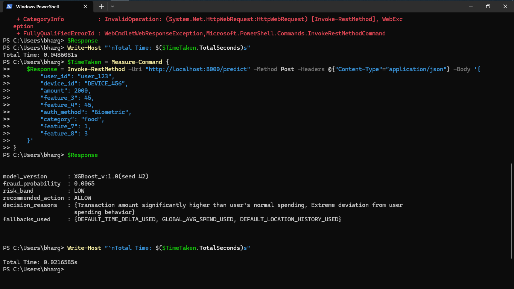

# Fraud Guard 2026: Real-Time Fraud Detection System


Fraud Guard 2026 is an end-to-end machine learning system for real-time transaction fraud detection. It covers synthetic transaction generation, fraud-focused feature engineering, cost-aware model training, threshold optimization, explainable API decisions, drift monitoring, and containerized serving.

The project is designed like a production-oriented ML portfolio build: it does not stop at notebook metrics. It trains a model, persists runtime artifacts, exposes a FastAPI prediction endpoint, returns business actions, and records the reasoning signals behind each decision.

## Executive Summary

| Area | What this project demonstrates |
| --- | --- |
| ML system design | Full pipeline from data generation to deployable inference |
| Fraud domain modeling | Spend anomaly, transaction velocity, authentication, merchant category, and location features |
| Imbalanced learning | Cost-sensitive threshold selection for rare fraud events |
| API engineering | FastAPI service with Pydantic validation and structured responses |
| Explainability | Decision reasons alongside fraud probability and risk band |
| Monitoring | Evidently-based data quality, data drift, and target drift reports |
| Deployment readiness | Dockerfile, saved model artifacts, tests, and reproducible pipeline entry point |

## Problem Statement

Fraud teams need fast decisions that balance customer friction against financial loss. A generic probability threshold such as `0.5` is rarely suitable because false negatives and false positives have very different business costs.

This project models that workflow:

1. Create transaction data with injected fraud patterns.
2. Engineer behavioral, temporal, categorical, and geospatial signals.
3. Train an imbalanced classification model.
4. Optimize the operating threshold using false-positive and false-negative costs.
5. Serve the decision through an API that returns probability, risk level, action, and explanation.

## System Architecture

```text
Synthetic transaction data
        |
        v
Feature engineering
        |
        v
Model training and grid search
        |
        v
Cost-sensitive threshold optimization
        |
        v
Model evaluation and SHAP reporting
        |
        v
FastAPI inference service
        |
        v
Fraud probability + risk band + action + decision reasons
```

## Key Capabilities

### Real-Time Fraud Scoring API

The API accepts a transaction payload and returns a complete fraud decision:

- `fraud_probability`: model score for fraud likelihood
- `risk_band`: `LOW`, `MEDIUM`, `HIGH`, or `VERY_HIGH`
- `recommended_action`: `ALLOW`, `CHALLENGE`, or `BLOCK`
- `decision_reasons`: human-readable signals behind the decision
- `fallbacks_used`: transparent defaults used when user history is missing
- `model_version`: model metadata returned with each response

### Fraud-Focused Feature Engineering

The system creates model-ready features that mirror common fraud review signals:

- transaction amount
- latitude and longitude
- hour of day
- day of week
- transactions in the previous 24 hours
- historical average user spend
- amount-to-user-average ratio
- distance from previous transaction
- implied travel velocity
- authentication method indicators
- merchant category indicators

### Geospatial Anomaly Detection

The API compares the current transaction location against the user's last known location using the Haversine formula. This supports impossible-travel style detection, where an account appears to transact from locations that are physically unrealistic within the observed time window.

### Cost-Sensitive Thresholding

The XGBoost model uses a separate optimized decision threshold instead of relying on the default `0.5` cutoff.

Current local threshold metadata:

```json
{
  "best_threshold": 0.97,
  "min_cost": 0.0,
  "cost_fp": 1.0,
  "cost_fn": 10.0
}
```

At inference time:

- `BLOCK` is returned when probability is greater than or equal to the optimized threshold.
- `CHALLENGE` is returned when probability is at least `0.50` but below the optimized threshold.
- `ALLOW` is returned below `0.50`.

Risk bands are mapped independently:

| Probability | Risk band |
| --- | --- |
| `>= 0.85` | `VERY_HIGH` |
| `>= 0.65` | `HIGH` |
| `>= 0.40` | `MEDIUM` |
| `< 0.40` | `LOW` |

## Demo Screenshot

The screenshot below shows a local PowerShell smoke test against `POST /predict`. The captured run returned a low-risk decision, an `ALLOW` action, decision reasons, fallback metadata, and an observed latency of about `0.0217` seconds.



Captured response highlights from the screenshot:

| Field | Value |
| --- | --- |
| Endpoint | `POST http://localhost:8000/predict` |
| Model version shown | `XGBoost_v:1.0(seed 42)` |
| Fraud probability shown | `0.0065` |
| Risk band shown | `LOW` |
| Recommended action shown | `ALLOW` |
| Decision reasons shown | `Transaction amount significantly higher than user's normal spending`; `Extreme deviation from user spending behavior` |
| Fallbacks shown | `DEFAULT_TIME_DELTA_USED`; `GLOBAL_AVG_SPEND_USED`; `DEFAULT_LOCATION_HISTORY_USED` |
| Timing shown | `0.0216585s` after the successful call; an earlier attempt shows `0.0486081s` next to a `WebCmdletWebResponseException` |

Note: the screenshot payload includes legacy smoke-test fields such as `device_id`, `feature_3`, `feature_4`, `feature_7`, and `feature_8`. The current FastAPI schema requires `lat` and `lon`; use the reproducible request below for this codebase.

## Project Structure

```text
.
|-- artifacts/
|   |-- models/
|   |   |-- random_forest_seed_42.json
|   |   `-- xgboost_seed_42.json
|   `-- model_thresholds/
|       |-- optimal_threshold_random_forest_seed_42.json
|       `-- optimal_threshold_xgboost_seed_42.json
|-- configs/
|   `-- config.yaml
|-- data/
|   |-- features/
|   |   |-- fraud_features_seed_42.csv
|   |   `-- fraud_features_seed_69.csv
|   `-- simulated/
|       |-- simulated_transactions_seed_42.csv
|       `-- simulated_transactions_seed_69.csv
|-- docs/
|   `-- assets/
|       `-- api-prediction-demo.png
|-- notebooks/
|   |-- EDA.ipynb
|   |-- data_creation_v1.ipynb
|   |-- feature_engineering_v1.ipynb
|   |-- model_training_and_evaluation_v1.ipynb
|   |-- _testing_pipeline.ipynb
|   `-- _testing_scripts.ipynb
|-- reports/
|   `-- drift_report_20260201_071922.html
|-- src/
|   |-- api/
|   |   `-- main.py
|   `-- fraud_detection/
|       |-- data_ingestion.py
|       |-- feature_engineering.py
|       |-- model_training.py
|       |-- threshold_optimization.py
|       |-- model_evaluation.py
|       |-- drift_monitoring.py
|       `-- training_pipeline.py
|-- tests/
|   `-- test_fraud_model.py
|-- Dockerfile
|-- pyproject.toml
|-- run_pipeline.py
`-- README.md
```

Generated data, model artifacts, model evaluation outputs, SHAP reports, and drift-monitoring outputs are ignored by Git through `.gitignore`. If these files are missing after cloning, regenerate them with the training pipeline.

## Tech Stack

- Python 3.12
- FastAPI and Pydantic v2
- Uvicorn
- XGBoost
- Scikit-learn
- Pandas and NumPy
- SHAP
- Evidently
- Matplotlib
- Docker
- pytest

## Installation

Create and activate a virtual environment:

```powershell
python -m venv .venv
.\.venv\Scripts\Activate.ps1
```

Install the project with development dependencies:

```powershell
python -m pip install -e ".[dev]"
```

## Run the API Locally

The API loads these runtime files at startup:

```text
artifacts/models/xgboost_seed_42.json
artifacts/model_thresholds/optimal_threshold_xgboost_seed_42.json
```

Start the service:

```powershell
uvicorn src.api.main:app --reload
```

Health check:

```text
http://localhost:8000/
```

Interactive API documentation:

```text
http://localhost:8000/docs
```

## Current Prediction Schema

`POST /predict` expects:

| Field | Type | Required | Notes |
| --- | --- | --- | --- |
| `user_id` | string | yes | Used to look up mock user history |
| `amount` | float | yes | Must be greater than `0` |
| `lat` | float or null | yes | Must be between `-90` and `90` |
| `lon` | float or null | yes | Must be between `-180` and `180` |
| `auth_method` | string | yes | One of `Biometric`, `PIN`, `Password` |
| `category` | string | yes | One of `food`, `grocery`, `tech`, `travel`, `utilities`, `entertainment` |
| `time_delta_min` | float or null | no | Defaults to `6.0` minutes when missing |
| `tx_count_24h` | integer or null | no | Defaults to `3` |

## Example Prediction Request

PowerShell:

```powershell
$Body = @{
    user_id = "user_123"
    amount = 2000
    lat = 40.7128
    lon = -74.0060
    auth_method = "Biometric"
    category = "food"
    tx_count_24h = 3
} | ConvertTo-Json

$TimeTaken = Measure-Command {
    $Response = Invoke-RestMethod `
        -Uri "http://localhost:8000/predict" `
        -Method Post `
        -Headers @{"Content-Type"="application/json"} `
        -Body $Body
}

$Response
Write-Host "`nTotal Time: $($TimeTaken.TotalSeconds)s"
```

Current response from the local model artifacts:

```json
{
  "model_version": "XGBoost_v:1.0",
  "fraud_probability": 0.0101,
  "risk_band": "LOW",
  "recommended_action": "ALLOW",
  "decision_reasons": [
    "Transaction amount significantly higher than user's normal spending",
    "Extreme deviation from user spending behavior"
  ],
  "fallbacks_used": [
    "DEFAULT_TIME_DELTA_USED",
    "GLOBAL_AVG_SPEND_USED",
    "NO_LOCATION_HISTORY"
  ]
}
```

## Run the Training Pipeline

Run the end-to-end pipeline with the default XGBoost configuration:

```powershell
python run_pipeline.py
```

Pipeline stages:

1. Generate synthetic transactions.
2. Engineer fraud-focused features.
3. Train the configured model with grid search.
4. Optimize the business decision threshold.
5. Evaluate the model and generate reports.

Model search space and evaluation metric configuration live in:

```text
configs/config.yaml
```

The included XGBoost configuration uses imbalanced-learning settings such as `scale_pos_weight`, regularization, shallow trees, subsampling, and `average_precision` scoring.

## Model and Artifact Inventory

| Artifact | Purpose |
| --- | --- |
| `artifacts/models/xgboost_seed_42.json` | Runtime model loaded by the API |
| `artifacts/models/random_forest_seed_42.json` | Alternative trained model artifact |
| `artifacts/model_thresholds/optimal_threshold_xgboost_seed_42.json` | Cost-optimized XGBoost threshold |
| `artifacts/model_thresholds/optimal_threshold_random_forest_seed_42.json` | Cost-optimized Random Forest threshold |
| `data/simulated/*.csv` | Synthetic transaction data |
| `data/features/*.csv` | Model-ready engineered features |
| `reports/drift_report_20260201_071922.html` | Existing Evidently drift report |

## Run with Docker

Make sure model artifacts exist before building the image. The Dockerfile copies `artifacts/` into the container so the API can load the model at startup.

Build:

```powershell
docker build -t fraud-guard-2026 .
```

Run:

```powershell
docker run --rm -p 8000:8000 fraud-guard-2026
```

Open:

```text
http://localhost:8000/docs
```

## Testing

Run the test suite:

```powershell
pytest -q
```

Current tests cover:

- model probability output stays within `[0, 1]`
- fraud risk does not drop sharply when transaction amount increases significantly

## Monitoring

The project includes an Evidently monitoring module for:

- data quality checks
- data drift detection
- target drift detection
- prediction score comparison between reference and current datasets

Monitoring reports are written as HTML files under `reports/`. The current repository includes:

```text
reports/drift_report_20260201_071922.html
```

## Troubleshooting

### `RuntimeError: Model file not found`

The API requires:

```text
artifacts/models/xgboost_seed_42.json
```

Run the training pipeline or restore the model artifact before starting the API.

### `RuntimeError: Threshold file not found`

The API requires:

```text
artifacts/model_thresholds/optimal_threshold_xgboost_seed_42.json
```

Run the training pipeline so threshold optimization can regenerate the file.

### `WebCmdletWebResponseException` from PowerShell

This usually means one of the following:

- the API server is not running on `localhost:8000`
- the request path or HTTP method is wrong
- the request body does not match the current Pydantic schema
- the API failed during model or threshold loading

Use `http://localhost:8000/docs` to inspect the live schema.

## Current Limitations

- User history is a small in-memory mock store, not a production feature store.
- Training data is synthetic and intended for portfolio demonstration.
- The API does not yet include authentication, rate limiting, request tracing, or structured audit logging.
- Model artifacts are local files rather than registry-managed versions.
- Drift reporting is batch-oriented and not connected to an alerting system.

## Recommended Next Improvements

- Add a real feature store or database-backed user profile service.
- Store predictions, decisions, fallbacks, and request IDs for auditability.
- Add CI for tests, linting, Docker builds, and API smoke tests.
- Add model registry integration for model and threshold versioning.
- Add batch retraining workflows when drift crosses a configured threshold.
- Add API authentication and rate limiting.
- Add richer integration tests around `/predict` using realistic request fixtures.

## Portfolio Takeaway

Fraud Guard 2026 demonstrates the full path from ML experimentation to deployable decision software. It combines model training, fraud signal design, threshold optimization, real-time API inference, explainable business decisions, monitoring, testing, and Docker packaging in one coherent project.
